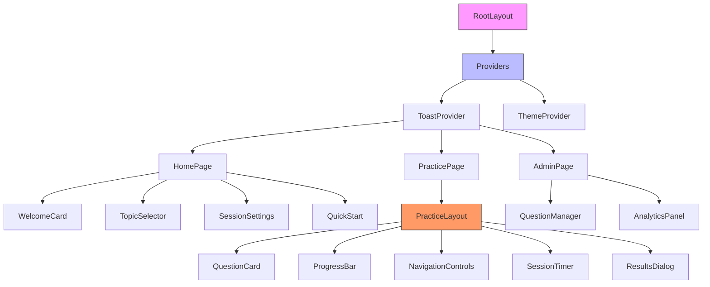
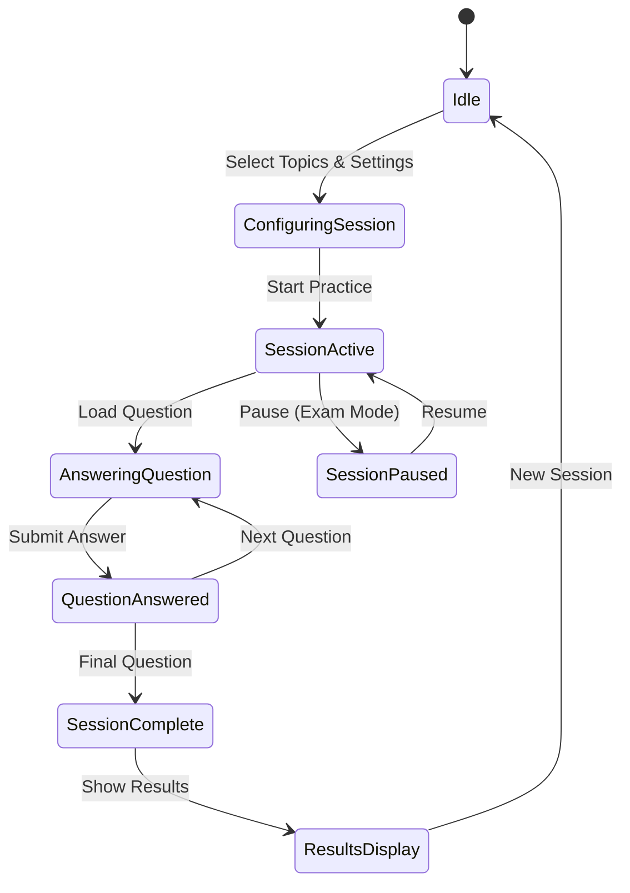

# SAP EWM Exam Practice Site - Shadcn/ui Design

## Overview

This design document outlines a complete rebuild of the SAP EWM (Extended Warehouse Management) exam practice website using modern technologies and Shadcn/ui components. The platform will be built from scratch with Next.js 15, React 19, TypeScript, and a comprehensive Shadcn/ui component library to create a production-grade exam practice experience.

The platform will feature 80 SAP EWM certification questions across 9 topics with advanced functionality including question shuffling, multiple-choice questions (MCQ), instant feedback, session management, and comprehensive analytics.

### Key Design Goals
- Build with modern Shadcn/ui components for consistent, accessible design
- Implement dynamic question shuffling with user preference controls
- Create smooth, responsive UI with built-in animations
- Add comprehensive session analytics and progress tracking
- Ensure production-grade performance and accessibility
- Provide intuitive admin mode for question management

## Technology Stack & Dependencies

### Core Technologies
- **Next.js 15.5.2** - React framework with App Router
- **React 19.1.0** - UI library with latest hooks and features
- **TypeScript** - Type safety and development experience
- **Tailwind CSS** - Utility-first styling framework

### Shadcn/ui Component Library
- **@radix-ui/react-accordion** - Collapsible content sections
- **@radix-ui/react-alert-dialog** - Modal dialogs and confirmations
- **@radix-ui/react-checkbox** - Multi-select answer options
- **@radix-ui/react-dialog** - Settings and results modals
- **@radix-ui/react-dropdown-menu** - Navigation and action menus
- **@radix-ui/react-progress** - Question progress indicators
- **@radix-ui/react-radio-group** - Single-select answer options
- **@radix-ui/react-select** - Topic and setting selectors
- **@radix-ui/react-separator** - Visual content dividers
- **@radix-ui/react-switch** - Toggle settings controls
- **@radix-ui/react-tabs** - Tabbed interface navigation
- **@radix-ui/react-toast** - Notification system
- **@radix-ui/react-tooltip** - Helpful UI hints

### Additional Dependencies
- **class-variance-authority** - Component variant management
- **clsx** - Conditional className utility
- **tailwind-merge** - Tailwind class merging
- **lucide-react** - Modern icon library
- **recharts** - Charts for analytics
- **react-hook-form** - Form management
- **zod** - Schema validation
- **date-fns** - Date manipulation utilities
- **framer-motion** - Advanced animations

### Development Tools
- **ESLint** - Code linting with Next.js configuration
- **Prettier** - Code formatting
- **TypeScript Config** - Strict type checking
- **Tailwind CSS** - Configured with Shadcn/ui theme

## Component Architecture

### Shadcn/ui Component Hierarchy



### Core Shadcn/ui Components

#### Layout Components
- **Card**: Question containers, result panels, setting cards
- **Separator**: Content dividers between sections
- **ScrollArea**: Scrollable question lists and results
- **Sheet**: Mobile navigation and settings panel

#### Form Components
- **RadioGroup**: Single-answer question options
- **Checkbox**: Multi-answer question options
- **Switch**: Toggle settings (shuffle, timer, etc.)
- **Select**: Topic selection and preferences
- **Button**: Actions, navigation, submissions

#### Feedback Components
- **Alert**: Important notifications and warnings
- **Badge**: Topic labels, score indicators, status
- **Progress**: Question completion and session progress
- **Toast**: Success/error notifications
- **Tooltip**: Helpful hints and explanations

#### Navigation Components
- **Tabs**: Different views (practice, results, analytics)
- **Breadcrumb**: Session navigation and location
- **DropdownMenu**: User actions and quick settings

## State Management

### Modern Context Architecture with Shadcn/ui



### Context Structure with Shadcn/ui Integration

```typescript
interface PracticeContextState {
  // Session Management
  session: {
    id: string
    mode: 'practice' | 'exam' | 'review'
    startTime: Date
    timeRemaining?: number
    isPaused: boolean
  }
  
  // Question Flow
  questions: {
    original: Question[]
    current: Question[]
    currentIndex: number
    totalCount: number
  }
  
  // User Interaction
  answers: {
    submitted: UserAnswer[]
    current: string[]
    isSubmitted: boolean
  }
  
  // UI State
  ui: {
    showResults: boolean
    isLoading: boolean
    notifications: ToastState[]
    theme: 'light' | 'dark'
  }
  
  // Settings
  preferences: {
    shuffle: ShuffleSettings
    selectedTopics: string[]
    autoAdvance: boolean
    showExplanations: boolean
  }
}
```

## Data Models

### Question Data Structure

```typescript
interface Question {
  id: number
  questionNumber: number
  totalQuestions: number
  topic: string
  question: string
  note?: string
  options: QuestionOption[]
  correctAnswers: string[]
  selectedAnswers: string[]
  metadata: QuestionMetadata
}

interface QuestionOption {
  id: string
  text: string
  isCorrect: boolean
  isSelected: boolean
}

interface QuestionMetadata {
  difficulty: 'easy' | 'medium' | 'hard'
  estimatedTime: number // seconds
  tags: string[]
  lastModified: Date
  attempts: number
  successRate: number
}
```

### Session Management Models

```typescript
interface PracticeSession {
  id: string
  userId?: string
  startTime: Date
  endTime?: Date
  mode: 'practice' | 'exam' | 'review'
  configuration: SessionConfiguration
  progress: SessionProgress
  results?: SessionResults
}

interface SessionConfiguration {
  selectedTopics: string[]
  shuffleEnabled: boolean
  shuffleSettings: ShuffleSettings
  timeLimit?: number
  autoAdvance: boolean
  showFeedback: boolean
}

interface SessionProgress {
  currentQuestionIndex: number
  answeredQuestions: number
  correctAnswers: number
  timeSpent: number
  questionResults: QuestionResult[]
}

interface QuestionResult {
  questionId: number
  selectedAnswers: string[]
  correctAnswers: string[]
  isCorrect: boolean
  timeSpent: number
  attempts: number
}
```

## Routing & Navigation

### App Router Structure

```
/                          # HomePage with topic selection
/practice                  # Practice session interface
/practice/[sessionId]      # Resume specific session
/results/[sessionId]       # Detailed results analysis
/admin                     # Question management
/settings                  # User preferences
```

### Navigation with Shadcn/ui Components

```typescript
// Main Navigation Component
const MainNavigation = () => {
  return (
    <nav className="border-b">
      <div className="flex h-16 items-center px-4">
        <div className="flex items-center space-x-4">
          <Button variant="ghost" asChild>
            <Link href="/">Home</Link>
          </Button>
          <Button variant="ghost" asChild>
            <Link href="/practice">Practice</Link>
          </Button>
          <Button variant="ghost" asChild>
            <Link href="/admin">Admin</Link>
          </Button>
        </div>
        
        <div className="ml-auto flex items-center space-x-4">
          <ThemeToggle />
          <DropdownMenu>
            <DropdownMenuTrigger asChild>
              <Button variant="ghost" size="sm">
                <Settings className="h-4 w-4" />
              </Button>
            </DropdownMenuTrigger>
            <DropdownMenuContent align="end">
              <DropdownMenuItem>
                <Link href="/settings">Settings</Link>
              </DropdownMenuItem>
            </DropdownMenuContent>
          </DropdownMenu>
        </div>
      </div>
    </nav>
  )
}
```

## Styling Strategy

### Shadcn/ui Theme Configuration

```css
:root {
  --background: 0 0% 100%;
  --foreground: 222.2 84% 4.9%;
  --card: 0 0% 100%;
  --card-foreground: 222.2 84% 4.9%;
  --popover: 0 0% 100%;
  --popover-foreground: 222.2 84% 4.9%;
  --primary: 221.2 83.2% 53.3%;
  --primary-foreground: 210 40% 98%;
  --secondary: 210 40% 96%;
  --secondary-foreground: 222.2 84% 4.9%;
  --muted: 210 40% 96%;
  --muted-foreground: 215.4 16.3% 46.9%;
  --accent: 210 40% 96%;
  --accent-foreground: 222.2 84% 4.9%;
  --destructive: 0 84.2% 60.2%;
  --destructive-foreground: 210 40% 98%;
  --border: 214.3 31.8% 91.4%;
  --input: 214.3 31.8% 91.4%;
  --ring: 221.2 83.2% 53.3%;
  --radius: 0.5rem;
}

.dark {
  --background: 222.2 84% 4.9%;
  --foreground: 210 40% 98%;
  --card: 222.2 84% 4.9%;
  --card-foreground: 210 40% 98%;
  /* ... dark theme colors */
}
```

## Feature Implementation

### HomePage with Shadcn/ui Components

```typescript
const HomePage = () => {
  const [selectedTopics, setSelectedTopics] = useState<string[]>([])
  const [shuffleEnabled, setShuffleEnabled] = useState(false)
  const [examMode, setExamMode] = useState(false)
  
  return (
    <div className="container mx-auto py-8">
      <Card className="mb-8">
        <CardHeader>
          <CardTitle className="text-3xl font-bold">SAP EWM Exam Practice</CardTitle>
          <CardDescription>
            Practice SAP Extended Warehouse Management certification questions
          </CardDescription>
        </CardHeader>
      </Card>
      
      <div className="grid grid-cols-1 lg:grid-cols-3 gap-6">
        <div className="lg:col-span-2">
          <TopicSelectionCard
            topics={topics}
            selectedTopics={selectedTopics}
            onTopicToggle={setSelectedTopics}
          />
        </div>
        
        <div className="space-y-6">
          <SessionSettingsCard
            shuffleEnabled={shuffleEnabled}
            examMode={examMode}
            onShuffleChange={setShuffleEnabled}
            onExamModeChange={setExamMode}
          />
          
          <QuickStartCard
            selectedTopics={selectedTopics}
            settings={{ shuffleEnabled, examMode }}
          />
        </div>
      </div>
    </div>
  )
}
```

### Topic Selection with Checkbox Groups

```typescript
const TopicSelectionCard = ({ topics, selectedTopics, onTopicToggle }) => {
  return (
    <Card>
      <CardHeader>
        <CardTitle>Select Topics</CardTitle>
        <CardDescription>
          Choose one or more topics to practice
        </CardDescription>
      </CardHeader>
      <CardContent>
        <div className="space-y-4">
          {topics.map((topic) => (
            <div key={topic.name} className="flex items-center space-x-3 p-3 rounded-lg border hover:bg-muted/50">
              <Checkbox
                id={topic.name}
                checked={selectedTopics.includes(topic.name)}
                onCheckedChange={(checked) => {
                  if (checked) {
                    onTopicToggle([...selectedTopics, topic.name])
                  } else {
                    onTopicToggle(selectedTopics.filter(t => t !== topic.name))
                  }
                }}
              />
              <div className="flex-1">
                <Label htmlFor={topic.name} className="font-medium cursor-pointer">
                  {topic.name}
                </Label>
                <p className="text-sm text-muted-foreground">
                  {topic.questionCount} questions
                </p>
              </div>
              <Badge variant="secondary">
                {topic.questionCount}
              </Badge>
            </div>
          ))}
        </div>
      </CardContent>
    </Card>
  )
}
```

### Practice Session with Shadcn/ui

```typescript
const PracticePage = () => {
  const { session, currentQuestion, progress } = usePracticeSession()
  
  if (!session) {
    return <Navigate to="/" />
  }
  
  return (
    <div className="min-h-screen bg-background">
      <PracticeHeader session={session} progress={progress} />
      
      <main className="container mx-auto py-6">
        <div className="grid grid-cols-1 lg:grid-cols-4 gap-6">
          <div className="lg:col-span-3">
            <QuestionCard question={currentQuestion} />
          </div>
          
          <div className="space-y-4">
            <ProgressCard progress={progress} />
            <NavigationCard />
            {session.mode === 'exam' && <TimerCard />}
          </div>
        </div>
      </main>
    </div>
  )
}
```

### Question Card Component

```typescript
const QuestionCard = ({ question }: { question: Question }) => {
  const { submitAnswer, selectAnswer } = usePracticeSession()
  const [selectedAnswers, setSelectedAnswers] = useState<string[]>([])
  const isMultiSelect = question.correctAnswers.length > 1
  
  return (
    <Card>
      <CardHeader>
        <div className="flex items-center justify-between">
          <Badge variant="outline">
            Question {question.questionNumber} of {question.totalQuestions}
          </Badge>
          <Badge variant="secondary">{question.topic}</Badge>
        </div>
        <CardTitle className="text-xl leading-relaxed">
          {question.question}
        </CardTitle>
        {question.note && (
          <Alert>
            <InfoIcon className="h-4 w-4" />
            <AlertDescription>{question.note}</AlertDescription>
          </Alert>
        )}
      </CardHeader>
      
      <CardContent>
        <div className="space-y-3">
          {isMultiSelect ? (
            // Multi-select with checkboxes
            <div className="space-y-3">
              {question.options.map((option) => (
                <div key={option.id} className="flex items-center space-x-3 p-3 rounded-lg border hover:bg-muted/50">
                  <Checkbox
                    id={option.id}
                    checked={selectedAnswers.includes(option.id)}
                    onCheckedChange={(checked) => {
                      if (checked) {
                        setSelectedAnswers([...selectedAnswers, option.id])
                      } else {
                        setSelectedAnswers(selectedAnswers.filter(id => id !== option.id))
                      }
                    }}
                  />
                  <Label htmlFor={option.id} className="flex-1 cursor-pointer">
                    {option.text}
                  </Label>
                </div>
              ))}
            </div>
          ) : (
            // Single select with radio group
            <RadioGroup
              value={selectedAnswers[0] || ''}
              onValueChange={(value) => setSelectedAnswers([value])}
            >
              {question.options.map((option) => (
                <div key={option.id} className="flex items-center space-x-3 p-3 rounded-lg border hover:bg-muted/50">
                  <RadioGroupItem value={option.id} id={option.id} />
                  <Label htmlFor={option.id} className="flex-1 cursor-pointer">
                    {option.text}
                  </Label>
                </div>
              ))}
            </RadioGroup>
          )}
        </div>
      </CardContent>
      
      <CardFooter className="flex justify-between">
        <Button variant="outline" disabled>
          <ArrowLeft className="h-4 w-4 mr-2" />
          Previous
        </Button>
        
        <Button
          onClick={() => submitAnswer(question.id, selectedAnswers)}
          disabled={selectedAnswers.length === 0}
        >
          Submit Answer
          <ArrowRight className="h-4 w-4 ml-2" />
        </Button>
      </CardFooter>
    </Card>
  )
}
```

### Results Dialog with Analytics

```typescript
const ResultsDialog = ({ session, onClose }: { session: CompletedSession; onClose: () => void }) => {
  const { results, analytics } = session
  
  return (
    <Dialog open onOpenChange={onClose}>
      <DialogContent className="max-w-4xl max-h-[90vh] overflow-y-auto">
        <DialogHeader>
          <DialogTitle className="text-2xl">Session Complete! 🎉</DialogTitle>
          <DialogDescription>
            Here's how you performed on your SAP EWM practice session
          </DialogDescription>
        </DialogHeader>
        
        <div className="space-y-6">
          {/* Overall Score */}
          <Card>
            <CardContent className="pt-6">
              <div className="text-center">
                <div className="text-4xl font-bold text-primary mb-2">
                  {Math.round((results.correctAnswers / results.totalQuestions) * 100)}%
                </div>
                <p className="text-muted-foreground">
                  {results.correctAnswers} out of {results.totalQuestions} correct
                </p>
              </div>
              
              <div className="grid grid-cols-3 gap-4 mt-6">
                <div className="text-center">
                  <div className="text-2xl font-semibold text-green-600">
                    {results.correctAnswers}
                  </div>
                  <p className="text-sm text-muted-foreground">Correct</p>
                </div>
                <div className="text-center">
                  <div className="text-2xl font-semibold text-red-600">
                    {results.incorrectAnswers}
                  </div>
                  <p className="text-sm text-muted-foreground">Incorrect</p>
                </div>
                <div className="text-center">
                  <div className="text-2xl font-semibold text-gray-600">
                    {results.skippedQuestions}
                  </div>
                  <p className="text-sm text-muted-foreground">Skipped</p>
                </div>
              </div>
            </CardContent>
          </Card>
          
          {/* Topic Breakdown */}
          <Card>
            <CardHeader>
              <CardTitle>Performance by Topic</CardTitle>
            </CardHeader>
            <CardContent>
              <div className="space-y-4">
                {analytics.topicPerformance.map((topic) => (
                  <div key={topic.name} className="space-y-2">
                    <div className="flex justify-between items-center">
                      <span className="font-medium">{topic.name}</span>
                      <Badge variant={topic.accuracy >= 70 ? 'default' : 'destructive'}>
                        {Math.round(topic.accuracy)}%
                      </Badge>
                    </div>
                    <Progress value={topic.accuracy} className="h-2" />
                    <p className="text-sm text-muted-foreground">
                      {topic.correctAnswers}/{topic.totalQuestions} questions correct
                    </p>
                  </div>
                ))}
              </div>
            </CardContent>
          </Card>
          
          {/* Action Buttons */}
          <div className="flex gap-3">
            <Button onClick={onClose} variant="outline" className="flex-1">
              Close
            </Button>
            <Button onClick={() => startNewSession()} className="flex-1">
              Practice Again
            </Button>
            <Button onClick={() => reviewIncorrect()} variant="secondary" className="flex-1">
              Review Mistakes
            </Button>
          </div>
        </div>
      </DialogContent>
    </Dialog>
  )
}
```

### Admin Question Management

```typescript
const AdminPage = () => {
  const [questions, setQuestions] = useState<Question[]>([])
  const [searchTerm, setSearchTerm] = useState('')
  const [selectedTopic, setSelectedTopic] = useState('all')
  
  return (
    <div className="container mx-auto py-8">
      <Card className="mb-6">
        <CardHeader>
          <CardTitle>Question Management</CardTitle>
          <CardDescription>
            Manage exam questions and their properties
          </CardDescription>
        </CardHeader>
      </Card>
      
      <div className="flex gap-4 mb-6">
        <div className="flex-1">
          <Input
            placeholder="Search questions..."
            value={searchTerm}
            onChange={(e) => setSearchTerm(e.target.value)}
          />
        </div>
        <Select value={selectedTopic} onValueChange={setSelectedTopic}>
          <SelectTrigger className="w-64">
            <SelectValue placeholder="Filter by topic" />
          </SelectTrigger>
          <SelectContent>
            <SelectItem value="all">All Topics</SelectItem>
            {topics.map((topic) => (
              <SelectItem key={topic.name} value={topic.name}>
                {topic.name}
              </SelectItem>
            ))}
          </SelectContent>
        </Select>
        <Button>
          <Plus className="h-4 w-4 mr-2" />
          Add Question
        </Button>
      </div>
      
      <QuestionDataTable
        questions={filteredQuestions}
        onEdit={handleEditQuestion}
        onDelete={handleDeleteQuestion}
      />
    </div>
  )
}
```

## Testing Strategy

### Component Testing with Shadcn/ui

```typescript
// Test Question Card with Shadcn components
describe('QuestionCard Component', () => {
  it('renders with Shadcn Card components', () => {
    render(<QuestionCard question={mockQuestion} />)
    
    expect(screen.getByRole('group')).toBeInTheDocument()
    expect(screen.getByText(mockQuestion.question)).toBeInTheDocument()
    
    // Test radio group for single answer
    if (mockQuestion.correctAnswers.length === 1) {
      expect(screen.getByRole('radiogroup')).toBeInTheDocument()
    } else {
      // Test checkboxes for multiple answers
      expect(screen.getAllByRole('checkbox')).toHaveLength(mockQuestion.options.length)
    }
  })
  
  it('handles answer selection with proper accessibility', () => {
    const onAnswerSelect = jest.fn()
    render(<QuestionCard question={mockQuestion} onAnswerSelect={onAnswerSelect} />)
    
    const firstOption = screen.getByLabelText(mockQuestion.options[0].text)
    fireEvent.click(firstOption)
    
    expect(firstOption).toBeChecked()
  })
})

// Test Topic Selection with Checkbox components
describe('TopicSelectionCard', () => {
  it('renders all topics with checkboxes', () => {
    render(<TopicSelectionCard topics={mockTopics} selectedTopics={[]} onTopicToggle={jest.fn()} />)
    
    mockTopics.forEach(topic => {
      expect(screen.getByText(topic.name)).toBeInTheDocument()
      expect(screen.getByRole('checkbox', { name: topic.name })).toBeInTheDocument()
    })
  })
})
```

### Question Shuffling Tests

```typescript
describe('Question Shuffling', () => {
  it('maintains question integrity after shuffling', () => {
    const shuffled = shuffleQuestions(mockQuestions)
    
    expect(shuffled).toHaveLength(mockQuestions.length)
    expect(shuffled.every(q => mockQuestions.find(orig => orig.id === q.id))).toBe(true)
  })
  
  it('preserves topic groups when enabled', () => {
    const shuffled = shuffleQuestions(mockQuestions, { preserveTopicGroups: true })
    
    // Verify topics remain grouped together
    const topicTransitions = getTopicTransitions(shuffled)
    expect(topicTransitions).toBeLessThanOrEqual(getUniqueTopics(mockQuestions).length)
  })
})
```

## Performance Optimization

### Shadcn/ui Performance Best Practices

```typescript
// Optimize large question lists with virtualization
const VirtualizedQuestionList = ({ questions }: { questions: Question[] }) => {
  return (
    <ScrollArea className="h-96">
      <div className="space-y-2">
        {questions.map((question) => (
          <Card key={question.id} className="p-4">
            <p className="text-sm">{question.question}</p>
          </Card>
        ))}
      </div>
    </ScrollArea>
  )
}

// Memoize expensive calculations
const ProgressCard = memo(({ progress }: { progress: SessionProgress }) => {
  const progressPercentage = useMemo(() => 
    Math.round((progress.answeredQuestions / progress.totalQuestions) * 100),
    [progress.answeredQuestions, progress.totalQuestions]
  )
  
  return (
    <Card>
      <CardContent className="pt-6">
        <div className="space-y-2">
          <div className="flex justify-between">
            <span>Progress</span>
            <span>{progressPercentage}%</span>
          </div>
          <Progress value={progressPercentage} />
        </div>
      </CardContent>
    </Card>
  )
})
```

### State Optimization

```typescript
// Optimize context with selective subscriptions
const usePracticeSession = () => {
  const context = useContext(PracticeContext)
  
  return useMemo(() => ({
    currentQuestion: context.questions.current[context.questions.currentIndex],
    progress: {
      current: context.questions.currentIndex + 1,
      total: context.questions.current.length,
      percentage: Math.round(((context.questions.currentIndex + 1) / context.questions.current.length) * 100)
    },
    submitAnswer: context.actions.submitAnswer,
    nextQuestion: context.actions.nextQuestion
  }), [context])
}
```

## Accessibility Features

### Shadcn/ui Accessibility Benefits

Shadcn/ui components come with built-in accessibility features:
- **Radix UI Primitives**: ARIA attributes, keyboard navigation, focus management
- **Screen Reader Support**: Proper labeling and announcements
- **Keyboard Navigation**: All interactive elements accessible via keyboard
- **Focus Management**: Proper focus trapping in modals and dialogs

### Enhanced Accessibility Implementation

```typescript
const AccessibleQuestionCard = ({ question }: { question: Question }) => {
  const correctAnswersCount = question.correctAnswers.length
  const totalOptions = question.options.length
  const isMultiSelect = correctAnswersCount > 1
  
  return (
    <Card>
      <CardHeader>
        <div className="sr-only">
          Question {question.questionNumber} of {question.totalQuestions}. 
          {isMultiSelect 
            ? `Select ${correctAnswersCount} correct answers from ${totalOptions} options.`
            : `Select 1 correct answer from ${totalOptions} options.`
          }
        </div>
        <Badge variant="outline" aria-label={`Question number ${question.questionNumber}`}>
          Question {question.questionNumber} of {question.totalQuestions}
        </Badge>
        <CardTitle>{question.question}</CardTitle>
      </CardHeader>
      
      <CardContent>
        {isMultiSelect ? (
          <div className="space-y-3" role="group" aria-labelledby="question-options">
            <div id="question-options" className="sr-only">
              Multiple choice question. Select all correct answers.
            </div>
            {question.options.map((option) => (
              <div key={option.id} className="flex items-center space-x-3">
                <Checkbox
                  id={option.id}
                  aria-describedby={`option-${option.id}-description`}
                />
                <Label htmlFor={option.id} className="flex-1">
                  {option.text}
                </Label>
                <div id={`option-${option.id}-description`} className="sr-only">
                  Option {option.id.toUpperCase()}
                </div>
              </div>
            ))}
          </div>
        ) : (
          <RadioGroup aria-label="Select one answer">
            {question.options.map((option) => (
              <div key={option.id} className="flex items-center space-x-3">
                <RadioGroupItem value={option.id} id={option.id} />
                <Label htmlFor={option.id} className="flex-1">
                  {option.text}
                </Label>
              </div>
            ))}
          </RadioGroup>
        )}
      </CardContent>
    </Card>
  )
}
```

### Keyboard Shortcuts

```typescript
const useKeyboardShortcuts = () => {
  const { nextQuestion, previousQuestion, submitAnswer } = usePracticeSession()
  
  useEffect(() => {
    const handleKeyPress = (event: KeyboardEvent) => {
      // Skip if user is typing in an input
      if (event.target instanceof HTMLInputElement) return
      
      switch (event.key) {
        case 'ArrowRight':
        case 'n':
          event.preventDefault()
          nextQuestion()
          break
        case 'ArrowLeft':
        case 'p':
          event.preventDefault()
          previousQuestion()
          break
        case 'Enter':
          event.preventDefault()
          submitAnswer()
          break
        case '1':
        case '2':
        case '3':
        case '4':
          if (event.ctrlKey || event.metaKey) {
            event.preventDefault()
            selectOption(parseInt(event.key) - 1)
          }
          break
      }
    }
    
    document.addEventListener('keydown', handleKeyPress)
    return () => document.removeEventListener('keydown', handleKeyPress)
  }, [nextQuestion, previousQuestion, submitAnswer])
}
```

## Mobile Responsiveness

### Responsive Design with Shadcn/ui

```typescript
const ResponsiveLayout = ({ children }: { children: React.ReactNode }) => {
  return (
    <div className="min-h-screen bg-background">
      {/* Mobile Header */}
      <div className="lg:hidden">
        <Sheet>
          <SheetTrigger asChild>
            <Button variant="ghost" size="sm" className="m-4">
              <Menu className="h-6 w-6" />
            </Button>
          </SheetTrigger>
          <SheetContent side="left">
            <MobileNavigation />
          </SheetContent>
        </Sheet>
      </div>
      
      {/* Desktop Layout */}
      <div className="hidden lg:flex lg:h-screen">
        <aside className="w-64 border-r bg-muted/10">
          <DesktopSidebar />
        </aside>
        <main className="flex-1 overflow-y-auto">
          {children}
        </main>
      </div>
      
      {/* Mobile Layout */}
      <div className="lg:hidden">
        <main className="p-4">
          {children}
        </main>
      </div>
    </div>
  )
}
```

### Touch-Optimized Components

```typescript
const TouchOptimizedAnswerOption = ({ option, onSelect }: AnswerOptionProps) => {
  return (
    <div className="touch-none select-none">
      <Label 
        htmlFor={option.id} 
        className="flex items-center space-x-3 p-4 rounded-lg border cursor-pointer min-h-[48px] hover:bg-muted/50 active:bg-muted transition-colors"
      >
        <RadioGroupItem value={option.id} id={option.id} />
        <span className="flex-1 text-left">{option.text}</span>
      </Label>
    </div>
  )
}

// Mobile-optimized progress indicator
const MobileProgressBar = ({ progress }: { progress: SessionProgress }) => {
  return (
    <Card className="sticky top-0 z-10 mb-4">
      <CardContent className="py-4">
        <div className="flex items-center justify-between mb-2">
          <span className="text-sm font-medium">
            Question {progress.current} of {progress.total}
          </span>
          <Badge variant="outline">
            {progress.percentage}%
          </Badge>
        </div>
        <Progress value={progress.percentage} className="h-2" />
      </CardContent>
    </Card>
  )
}
```